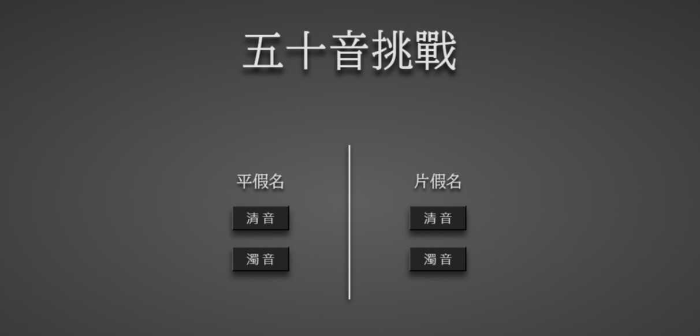
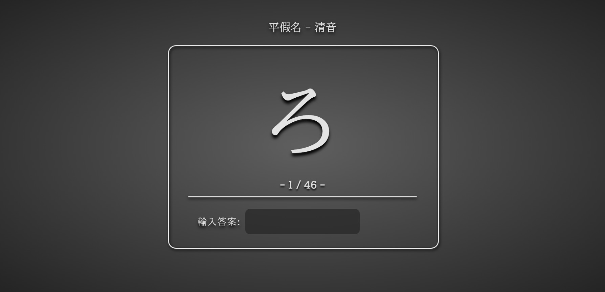
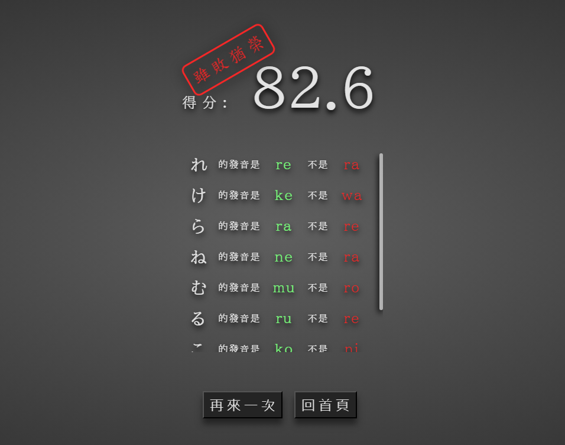

<h1 align='center'>五十音學習網站</h1>

製作一個學習日文五十音的網站，其內容包含平假名與片假名的 **_清音_** 與 **_濁音_**。  
為了學習日語之外，想透過此專案學習 Typescript、GitHub Actions。

## 目錄

- [專案建置](#專案建置)
- [網站介紹](#介紹)
  - [首頁畫面](#首頁畫面)
  - [遊玩畫面](#遊玩畫面)
  - [結束畫面](#結束畫面)
  - [開啟方式](#開啟方式)

## 專案建置

本專案是使用 Vite 建置的，專案內使用:

- [styled-component](https://styled-components.com/) 設定組件樣式與全域樣式。
- [Redux Toolkit](https://redux-toolkit.js.org/) 管理頁面狀態、題目狀態。
- [TypeScript](https://www.typescriptlang.org/) 增強型別定義。
- 透過 [Github Action](https://github.com/features/actions) 自動部屬靜態網站。
- 字體來源 [Google Font](https://fonts.google.com/)。

## 介紹

此網站的製作發想是基於於[這篇文章](https://medium.com/the-bayesian-trap/19-%E5%AF%AB%E7%A8%8B%E5%BC%8F%E4%BE%86%E5%B9%AB%E8%87%AA%E5%B7%B1%E5%BC%84%E6%87%82-%E3%81%82%E3%81%84%E3%81%86%E3%81%88%E3%81%8A-a316b4957488)。  
透過輸入拚音的方式來記住平假名或片假名的發音。

- #### 首頁畫面

  在首頁中可以看見有四個選項，可以從這選擇想要的題目類型。

  

- #### 遊玩畫面

  在遊玩畫面中( 如下圖，以平假名的清音為例 )，題目部分為`ろ`，因此在下方`輸入答案`旁邊的黑框中輸入其拼音`ro`後按下<kbd>Enter</kbd>即可。

  

- #### 結束畫面

  在所有題目作答完成後便會結束，在這畫面中( 如下圖 )可以看到先前作答的結果並以分數顯示，若有錯誤的則會在中間出現，綠色為正確拼音，紅色部分則是剛才輸入的結果。

  

- #### 開啟方式

  在理解此網站的基本操作後，是不是躍躍欲試想嘗試看看自己的日語程度了呢。

  這邊提供兩個方式讓你可以遊玩的方式。

  1. 透過連結:  
     直接點擊旁邊的文字即可開啟，[前往網站](https://lucien-mhl.github.io/LearnJP3/)。

  2. 透過本地端:  
     使用 npm

     ```bash
     npm install
     ```

     ```bash
     npm run start
     ```

     使用 yarn

     ```bash
     yarn install

     #or
     yarn
     ```

     ```bash
     yarn start
     ```
